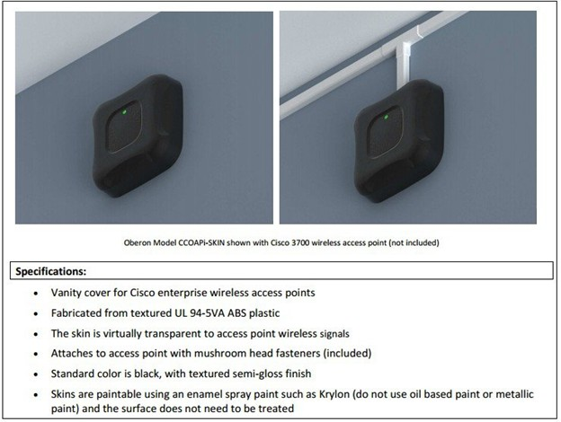
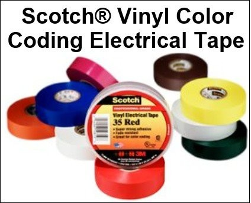
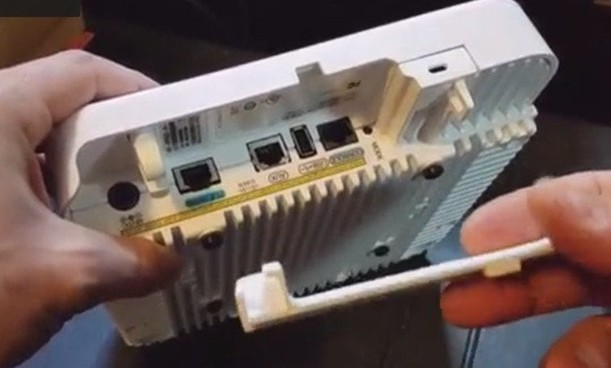
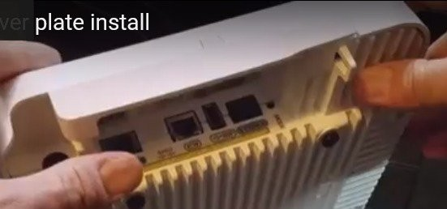
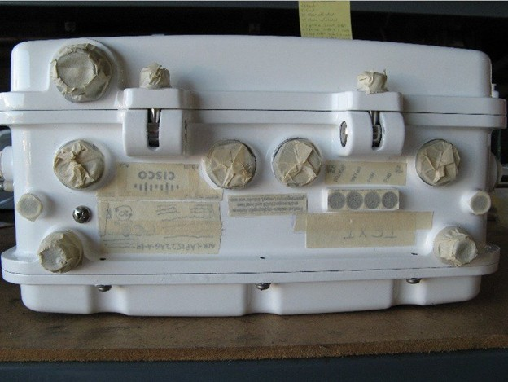

# Изменение цвета точек доступа. Перевод гайда от Cisco Systems.

## Вопрос по применению:
У меня есть клиент, который по эстетическим соображениям хотел бы покрасить точки доступа. Стоит ли это поощрять? Кроме того, аннулирует ли это гарантию? Есть ли какие-либо сторонние решения?

## Ответ на заявку:
 Я бы рекомендовал клиентам не красить точку доступа по следующим причинам:
1.	Покраска — это навык, который отличается по качеству, часто с неожиданными побочными эффектами, такими как попадание краски в разъемы RF и Ethernet и т. д.
2.	Цвет может повлиять на тепловые и наработки на отказ устройства.
3.	Краска может заткнуть критические отверстия, необходимые для отвода тепла и/или отвода влаги.
4.	Некоторые краски содержат проводящие свойства, которые могут ухудшить работу RF.
5.	Окрашенное изделие считается «модифицированным» изделием клиента, что делает его непригодным для эксплуатации, поэтому гарантия производителя считается недействительной.
6.	Непригодным к эксплуатации означает, что изделие было возвращено не тем способом, каким оно было продано. Нам необходимо иметь возможность восстановить изделие (поскольку гарантийный ремонт часто представляет собой замену) для целесообразности, поэтому ремонт и возврат модифицированного изделия нецелесообразны.

Вместо фактического нанесения краски предпочтительным решением для покраски было бы использование цветных пластиковых крышек, называемых «кожухами», многие сторонние компании предлагают такие виды продукции (из цветных оболочек), которые широко доступны.

Другие компании, предлагающие услуги 3D-печати, могут изготавливать индивидуальные корпуса любой формы или вида. Следует проявлять осторожность при полной изоляции точки доступа, чтобы убедиться, что происходит правильное распределение тепла, чтобы вы не значительно снизили тепловые характеристики, что может привести к преждевременным отказам или сокращению MTBF (среднее время безотказной работы).

Рисунок 1. Oberon предлагает чехлы (Skin) для точек доступа Cisco:

http://oberoninc.com/images/WebDocs/CCOAPi_Skin_Spec_Sheet.pdf 

Рисунок 2. Можно использовать ПВХ-ленту или листовой материал:

http://solutions.3m.com/wps/portal/3M/en_US/EMDCI/Home/Products/ProductCatalog/~/Scotch-Vinyl-Color-Coding-Electrical-Tape-35?N=5432987+3294355725&rt=rud

Также возможно использование сторонних сервисов 3D-печати для индивидуальных решений. Например, такие компании, как www.shapeways.com, могут изготавливать индивидуальные накладки или другие решения с помощью 3D-печати, которые затем можно покрасить и при этом снять, если потребуется гарантийное обслуживание.

Рисунок 3. Пример 3D-печатной крышки:

Рисунок 4. Пример установленной крышки, напечатанной на 3D-принтере.

http://www.shapeways.com/product/M67DCYSEM/cisco-ap-3802-cover-plate?optionId=60844434 

Старайтесь использовать модификации, которые можно удалить, чтобы устройство можно было вернуть для обслуживания в том же состоянии, в котором оно было на момент покупки.

В противном случае, скорее всего, гарантия будет аннулирована. Если клиент принимает решение о том, что аннулирование гарантии приемлемо, и все равно решает покрасить устройство, вот несколько рекомендаций по покраске устройств RF (точки доступа).

Используйте краску, которая не имеет проводящих свойств (например, чешуйки металлического цвета и т. д.).

Вот некоторые краски, которые были протестированы и показали хорошие радиочастотные характеристики:

| Brand Name | Product Line | Color | Spray Can Part Number | Gallons Part Number |
| --- | --- | --- | --- | --- |
| Rust-Oleum | Professional | Gray Primer | 7582 | 7769 (Aluminum Primer) |
| Rust-Oleum | Professional | Light Machine Gray | 7581 | 7781 |
| Rust-Oleum | Professional | Dark Machine Gray | 7587 | 7786 (Smoke Gray) | 
| Rust-Oleum | Professional | Hunter Green | 7538 | 7738 | 
| Rust-Oleum | Professional | Dark Brown | 7548 | 7748 |
| Rust-Oleum | Professional | Gloss Black | 7579 | 7779 |

Рисунок 5. При покраске не допускайте попадания краски на разъемы (заклейте их тщательно лентой):

Покраска — это вопрос мастерства и способности правильно подготовить краскопульт к покраске. Попробуйте протестировать краску на похожем материале (или на месте, которое не видно), чтобы определить ее пригодность.

Если точка доступа находится на улице, учтите, что солнце будет влиять на температуру устройства, так как устройство, окрашенное в черный цвет, будет получать больше солнечного тепла, чем, скажем, то, которое окрашено в белый цвет.

Опять же, рассмотрите возможность использования пластиковых крышек или других корпусов, возможно, покрасьте корпус, а не само устройство, когда это возможно/практично.

[Оригинальный гайд от Cisco](./Original_guide/Cisco%20Guide.pdf)
