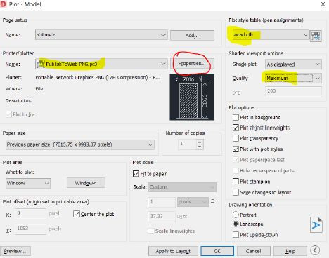
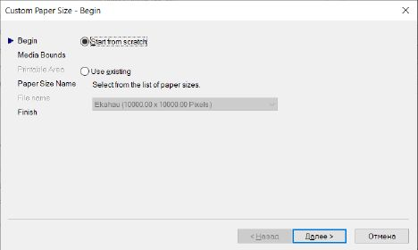
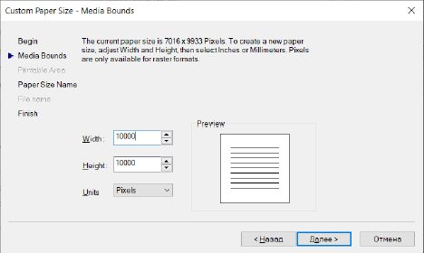
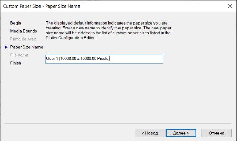
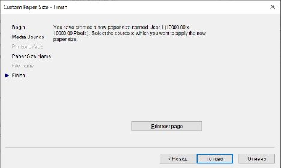
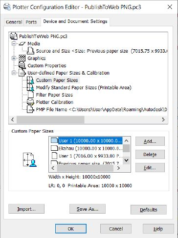
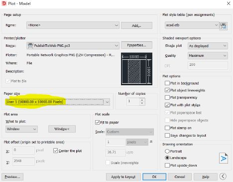

# Как экспортировать из AutoCAD с разрешением до 10000x10000? / How to export from Autocad with resolution 10000x10000.

Многие в раьботе используют PDF файл с инкапсулированными чертежами. Ekahau при этом всё это обрабатывает не достаточно быстро. Более эффективным способом, в этом плане, является использование картинок в PNG формате. Соответственно возникает вопрос, как экспортировать из AutoCAD в нужном нам разрешении до 10000x10000?

Файл > Печать/Plot:

Properties, Выбираем Custom Papper size и жмём Add:

Жмём Далее и выставляем размеры: 

Обзываем профиль:

Готово!

Мы видим этот вариант:

Выбираем этот вариант:

Не забываем указать через “Window<” фрейм, который хотим экспортировать. Жмём OK. Загружаем как карту в Ekahau. Наслаждаемся жизнью. 