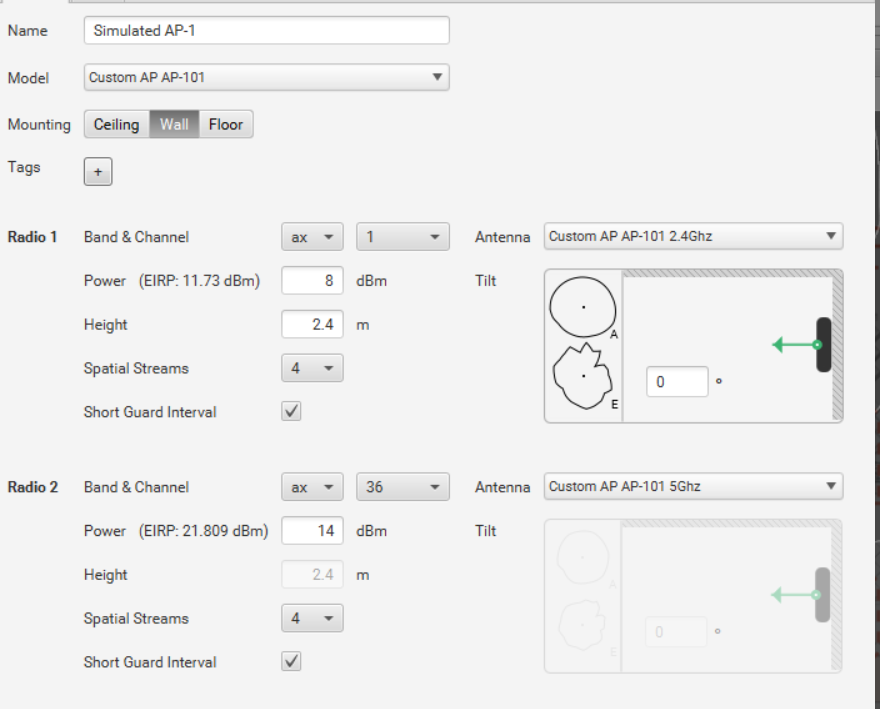

# Добавление своей точки доступа в Ekahau / How to add custom AP in Ekahau?

У многих из нас возникает вопрос: Как добавить новую точку доступа в Ekahau?

Ответ на данный вопрос достаточно прост и кроется в конфигурациионных файлах Ekahau и даташите на точку доступа.

You need datasheet to AP and access to configuration file of Ekahau.

Сразу скажу, что если Вы это делаете, то понимаете, что делаете и зачем. Всё сделаное Вами делается на ваш страх и риск.

Папку инсталляции Ekahau обозначим как `root`.

Installation folder of Ekahau we will mark as `root`.

Соответственно конфигруационные файлы по точкам доступа лежат в `root\conf\accessPointTypes.xml`.

AccessPoint configuration file `root\conf\accessPointTypes.xml`.

Простой случай: необходимо создать точку доступа 4:4x4 с частотами 2.4 Ghz и 5Ghz, технология AX, антенны встроенные, без BLE. За основу возьмём, наприпер, Aruba AP-503H.

Sample: You need to create new AP 4:4x4 with 2.4 Ghz and 5Ghz, AX, internal antennas, w/o BLE. Aruba AP-503H will base AP for sample.

В конфигруационном файле находим секцию / You need seach section in configuration file:

    <accessPointType vendor="Aruba" model="AP-503H">
        <radioType technology="ax" frequencyBand="2.4" mimo="2x2" spatialStreams="2"/>
        <radioType technology="ax" frequencyBand="5" mimo="2x2" spatialStreams="2"/>
        <radioType radioTechnology="bluetooth" frequencyBand="2.4" defaultAntennaBluetooth="Aruba AP-503H BLE"/>
    </accessPointType>

Копируем её и создаём свою / You need make copy and correct it:
 
    <accessPointType vendor="Custom AP" model="AP-101">
        <radioType technology="ax" frequencyBand="2.4" mimo="4x4" spatialStreams="4"/>
        <radioType technology="ax" frequencyBand="5" mimo="4x4" spatialStreams="4"/>
    </accessPointType>

Сохраняем / Save.
  
Также необходимо добавить антенны. Эти данные хранятся в архиве `root\conf\antennas.zip`.

Also you must add antennas. Antennas in file `root\conf\antennas.zip`.

Ищем в архиве следующие файлы / Search in archive next files:

    Aruba AP-503H 2.4GHz.json
    Aruba AP-503H 5GHz.json
    Aruba AP-503H BLE.json

Делаем их копию, обозвав соответствующим образом / You make copy and change name:

    Custom AP AP-101 2.4Ghz.json
    Custom AP AP-101 5Ghz.json
  
Если открыть эти файлы на редактирование, то увидим описание диаграммы направленности антенны:

If you open these files for editing, we will see a description of the antenna pattern:

    {
        "directional": false,
        "horizontalPlane": {
            "alignment": {
                "degrees": 90.0
            },
        "gains": [
        {
          "angleInDegrees": 0.0,
          "dBi": 3.3
        },
        {
          "angleInDegrees": 5.0,
          "dBi": 3.38
        }
    ... (etc..)
  
Данные можно взять из даташита и внести в соответствующие поля, как для `horizontalPlane`, так и для `elevationPlane`.

You must to see in datasheet and correct record in file for `horizontalPlane` and `elevationPlane`.

Обратите внимание на то, что в конце файла также необходимо скорректировать записи:

Also you must correct record in end of file:

  
    "frequencyBand": "TWO",
    "accessPointVendorModel": {
    "vendor": {
        "vendor": "Custom AP"
    },
    "model": {
        "model": "AP-101"
    }
    },
    "wcsMapping": {},
    "defaultTiltAngle": {
    "degrees": 0.0
    },
    "manufacturerMaximumGain": NaN,
    "antennaTechnology": "WIFI",
    "defaultMounting": "WALL",
    "apCoupling": "INTERNAL_ANTENNA"
    }
  
Файлы необходимо будет сохранить в архиве с антеннами / You must save file in archive with anntennas data.

Итого получим / Final:

Дальнейшее изучение файла `accessPointTypes.xml` поможет Вам понять, как корректно добавлять точки с теми или иными настройками.

Further study of the `accessPointTypes.xml` file will help you understand how to correctly add points with certain settings.

[Antenna_Converter.xlsx](./Antenna_Converter.xlsx) - удобный файл для перегонки значений из значений Antenna Pattern Editor в формат Ekahau. Спасибо Adner.

PS: В папке [AP_and_antennas](./AP_and_antennas/) могут находится конифгурации точек доступа и антенн, которых нет в официальном дистрибутиве. Если Вы хотите сделать конфигурацию какой-то точки доступа или антенны общедоступными, то Вы можете сделать это через Pull Request.

PS: The [AP_and_antennas](./AP_and_antennas/) folder may contain configurations of access points and antennas that are not in the official distribution. If you want to make the configuration of some access point or antenna public, then you can do this through a Pull Request.

## Начиная с верси Ekahau 11.6.x, профили точек доступа и антенн лежат в "user_profile"\Ekahau Pro\\.settings\

# change log:
 2024-03-04 + Eltex WOP-30LS
 2023-11-01 + ZRJ WAP-I3, WAP-X2, WAP-X4, WAP-X10, WAP-XW2
 2023-05-31 + Eltex: WEP-2L, LWEP-3L, WOP-20L, WEP-30L, WEP-200L
 2022-11-15 + Reyee RAP1200(F)  
 2022-06-24 + Vector VAP300-2X2i, VAP300-2X2i-W, VAP500-4X4i  
 2022-04-29 + Eltex WEP-3ax
