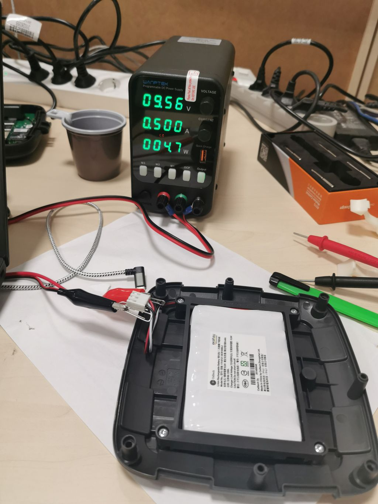

# Аккумуляторная батарея Sidekick / Sidekick battery.

Что делать, если Sidekick не включается? С очень большой вероятностью разрядилась батарея ниже уровня, при котором она встаёт на зарядку. Из личного опыта - при 7.6В Sidekick не ставил батарею на зарядку.

Что делать? Вам понадобится внешний истоник питания, который позволит ограничить напряжение зарядки батареи на уровне 12.6В и ток до 0.5А. Разбираем Sidekick, снимаем батарею, проверяем напряжение. Пробуем поставить на зарядку (я изначально выставил 12.6В и ток 0.1А). Через какое-то время ток поднял до 0.5А:

При достижении 9.6В прекратил заряд от внешнего испточника и подключил батарею обратно к Sidekick. Дальше зарядка продолжилась уже средствами Sidekick.

Удачи!
Всё что выделаете, Вы делаете на свой страх и риск.

Справочно: во время сюрвея или live monitoring Sidekick потребляет до 0.7А. В простое 0.4-0.5А. Это будет полезно тем, кто захочет сделать разъём для подключения внешнего power bank'а.

В [images](./images/) можно посмотреть фотографии аккумуляторной батареи Sidekick. Это 6 банок 18650 + плата контроллера и балансировщика. По идее, в случае прихода сборки в негодность, её могут отремонтировать в любом центре по ремнту ноутбуков.