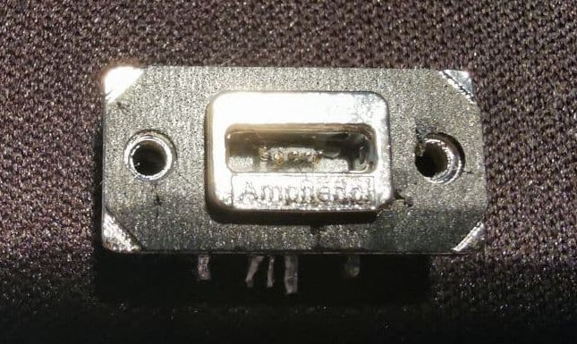
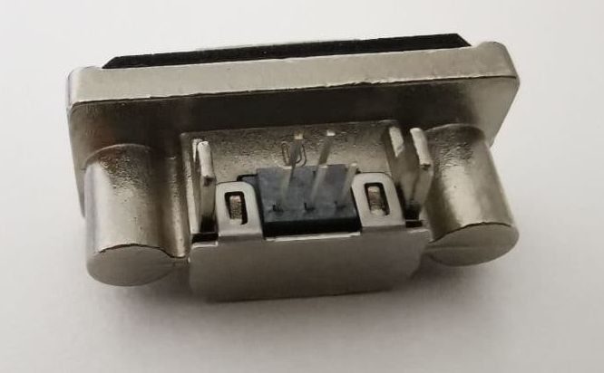
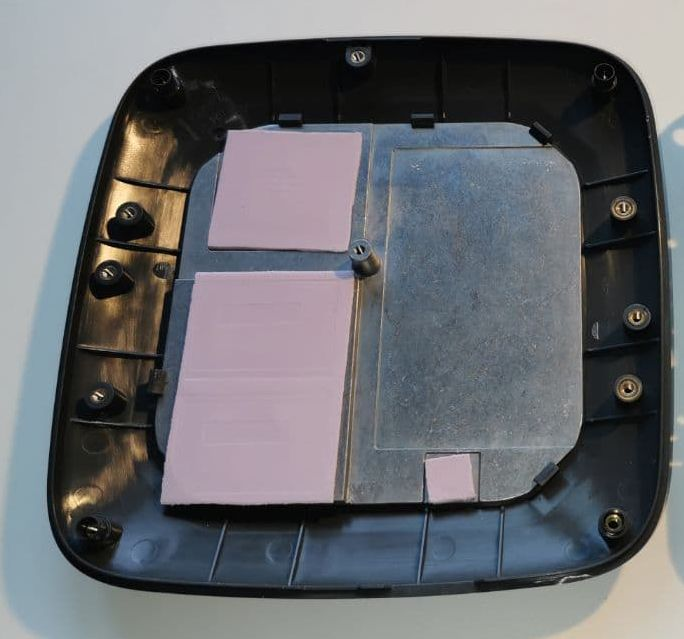

# Замена micro-USB разъёма в Ekahau Sidekick.

Правильно говорят - береги честь с молоду, а я вам хочу сказать - берегите свои Sidekick'и "с молоду". Не доверяйте их в "кривые" руки. USB разъём Sidekick нежен и может поломаться, при неправильном обращении. Не зря на корпусе нарисовано, как правильно вставлять кабель. Привести это может вот к таким вот печальным последствиям:

They say correctly - take care of honor from a young age, but I want to tell you - take care of your Sidekick "from a young age". Do not trust them in "crooked" hands. The Sidekick USB connector is delicate and can break if mishandled. It is not in vain that the case is drawn on how to insert the cable correctly. This can lead to the following unfortunate consequences:

Для ремонта понадобится ['MUSB-K152-30 Amphenol'](./Amphenol/1musbk152xx.pdf). Найти условно быстро удалось в Chip&Dip. Цены гуляют на рынке от 800 рублей и выше:

For repair you need ['MUSB-K152-30 Amphenol'](./Amphenol/1musbk152xx.pdf):

Для отктытия Sidekick необходимо открутить все винты в корпусе Sidekick. Это приведёт однозначно к потере гарантии, если Sidekick у вас находится на гарантии. Когда всё открутите, плата не будет сниматься - её держат термоинтерфейсы. Рашается аккуратным подогревом радиатора феном. Чтобы побыстрее - ставил на паяльной станции 225 градусов и водил феном над радиатором, пока он не стал достаточно тёплым и термоинтерфейсы не разогрелись:

To open the Sidekick, you must unscrew all the screws in the Sidekick housing. This will definitely void your warranty if your Sidekick is under warranty. When you unscrew everything, the board will not be removed - it is held by thermal interfaces. It is solved by gently heating the radiator with a hair dryer. To make it faster, I set 225 degrees on the soldering station and drove a hair dryer over the radiator until it became warm enough and the thermal interfaces warmed up:

Обратной сборка - с винтами также нежно, т.к. их длина буквально высчитана впритык и можно перетянув поднадавть на пластик и получить на поверхности небольшие неровности.

Reverse assembly - also gently with screws, because their length is literally calculated end-to-end and you can drag it on the plastic and get small bumps on the surface.

С очень большой вероятностью кабель тоже придётся купить новый, т.к. родной наверняка также испорчен.

With a very high probability, you will also have to buy a new cable, because native probably also corrupted.

Итог с новым разъёмом:

Final:

Удачи!
Всё что выделаете, Вы делаете на свой страх и риск.