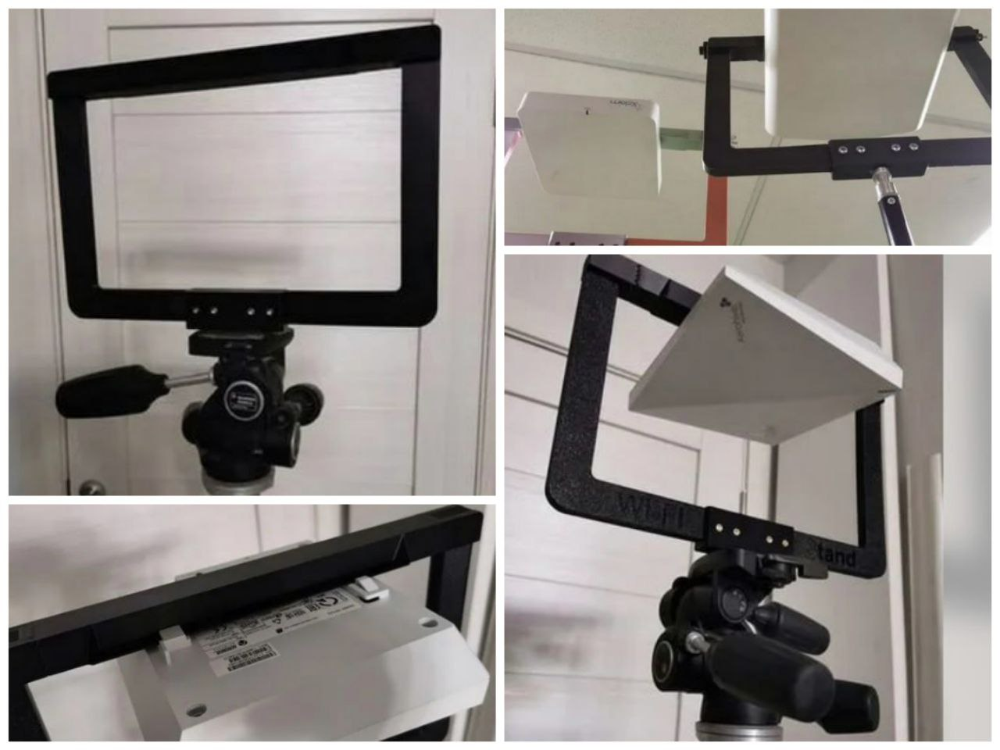

# Wi-Fi Stand - рамка для подвеса точки доступа при проведении радиообследования на объекте.

- Wi-Fi Stand, можно купить [тут](https://wifistand.com/) или [тут (если Вы из РФ)] (https://www.avito.ru/sankt-peterburg/tovary_dlya_kompyutera/wi-fi_stand_wi-fi_stend_2388694430) /You can to buy [here](https://wifistand.com/) or [here (if you from Russia)](https://www.avito.ru/sankt-peterburg/tovary_dlya_kompyutera/wi-fi_stand_wi-fi_stend_238869443).
- 3D печатная версия рамки/3D printing version:
    - [Версия 1 / Version 1](https://www.thingiverse.com/thing:4819305), с неё всё начиналось / First version.
    - [Версия 2 / Version 2](https://www.thingiverse.com/thing:5292474), со стальной шпилькой в верхней части / with steel pin at the top.
    - [Версия 3 (с впаиваемыми гайками M3) / Version 3 (with M3 solder nuts)](./STL/WiFiStand3.stl), необходим split на объекты в слайсере / You must to split to object in slicer. Также её можно [приобрести на Avito.ru](https://www.avito.ru/sankt-peterburg/tovary_dlya_kompyutera/wi-fi_stand_wi-fi_stend_2388694430). В Addon лежат дополнительные варианты элементов для дугих размеров рамки.
- [Лучшая стойка/штатив/Best Stand / Tripod](https://www.manfrotto.com/ru-ru/photo-master-stand-air-cushioned-1004bac/), MANFROTTO 1004BAC.
- [Альтернативный вариант стойки / Stand alternative](https://falcon-eyes.ru/catalog/archive/stoyka-falcon-eyes-l-3900a-b-dlya-osveshcheniya/), Falcon Eyes L-3900 ST.0.
