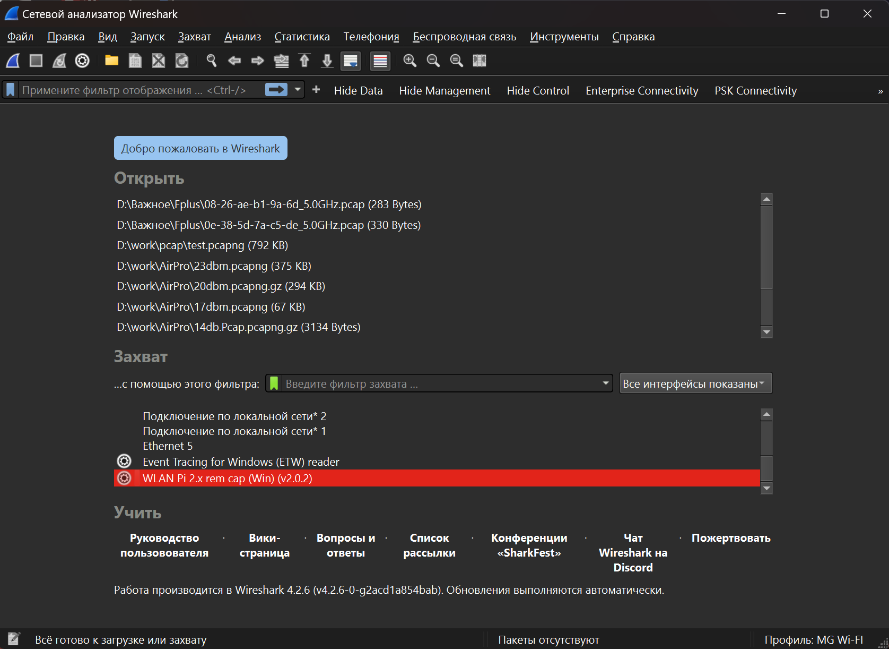
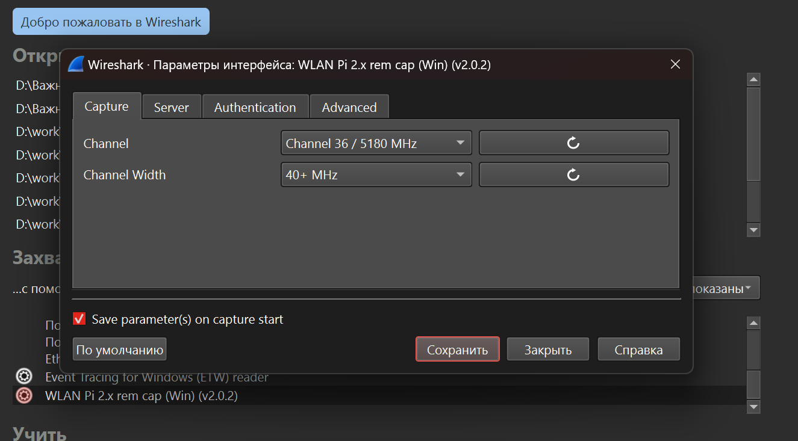
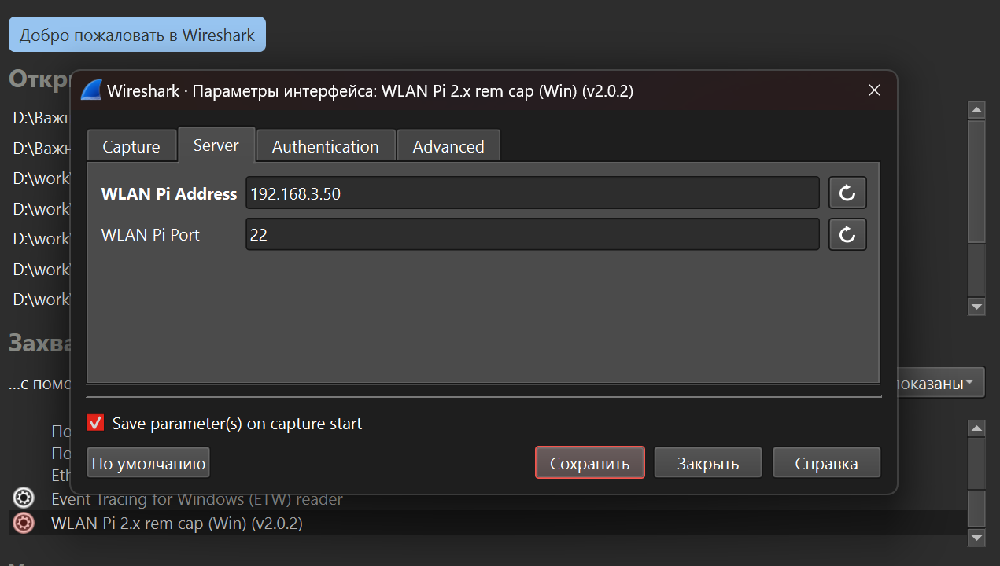
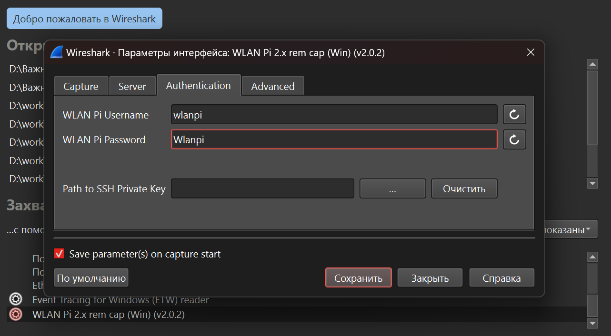
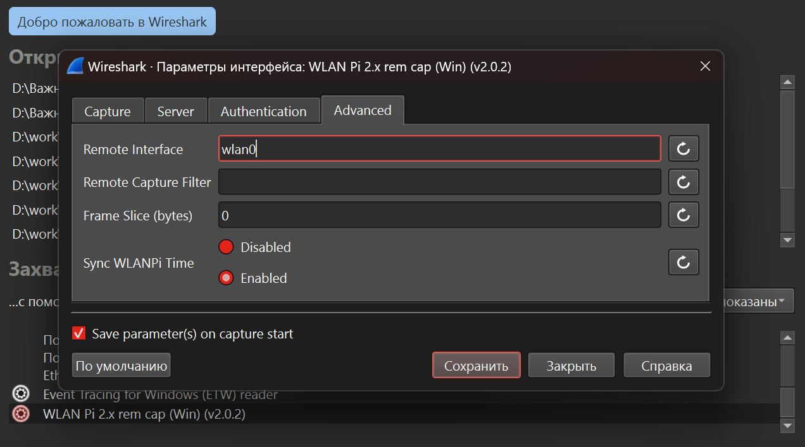

# Собираем удалённо пакеты используя WlanPI и Wireshark.

Оригинал: https://github.com/wifinigel/wlan-extcap-win

Чтобы использовать WlanPI для удалённой сборки пакетов в Wireshark, необдходимо:
- установить Wireshark с sshdump;
- добавить в папку 'patch Wireshark folder\Wireshark\extcap\' файл [wlanpidump_v2.bat](./files/wlanpidump_v2.bat) 
- запустить Wireshark и настроить доступ к WlanPI:

Скриншоты:

