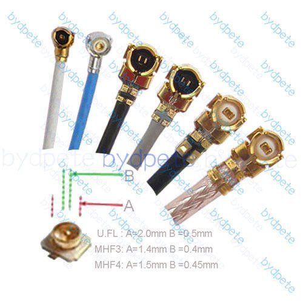

# WlanPI

Официальный сайт WLANPI https://www.wlanpi.com/. Документация настоятельно рекомендуется к изучению.

Репозитарий на Github https://github.com/WLAN-Pi/. Какие-то нюансы работы приложений Wlan Pi настоятельно рекомендуется изучать в соответствующем разделе репозитария.

Полезное:
- [Сборка WLAN PI](./build/README.md)
- [Собираем удалённо пакеты используюя WlanPI и Wireshark](./Capture/README.md)
- [Добавление регуляторного домена RU в FPMS (меню)](./Domain_RU_fpms/README.md)
- [Как запустить несколько экземпляров iperf3?](https://mac-wifi.com/running-logging-multiple-iperf-services-on-the-wlanpi/)
- [Вариант запуска iperf3 для обработки запросов сразу от нескольких клиентов на разных портах, через ngix.](./iperf3/README.md)
- [Как проверить, поддерживает ли Wi-Fi сеть 802.11k?](https://semfionetworks.com/blog/wireshark-how-to-check-if-a-wi-fi-network-supports-80211k/)
- [Как проверить, поддерживает ли Wi-Fi сеть 802.11k/r?](https://mac-wifi.com/how-to-verify-whether-802-11k-and-11r-are-enabled-via-a-capture/)
- WlanPi Chat Bot в Telegram:
  - [Telegram Chat Bot](https://github.com/WLAN-Pi/wlanpi-chat-bot)
  - [Speedtest in Chat Bot](https://www.speedtest.net/apps/cli)
  - ["Ремонт" работы speedtest в WlanPi Chat Bot](./Wlanpi-chat-bot/README.md)
- [Автоматизация перебора каналов вещания для получения оффсетов клиентских устройств через скрипт](./Wlanpi_offsets/README.md)
- [Если у вас зависает WLAN PI с Mediatek mt7925.](./mt7925/README.md)
- [WLAN Pi Profiler](./Profiler/README.md)
- [WLAN Pi Cookbook](https://wlanpi.gitbook.io/cookbook)

Комплект компонентов для сборки WLANPI M4(+):

| Наименование | Стомость на 02.12.2024 | Ссылка |
| --- | --- | --- |
| Raspberry Pi CM4, (рекомендация от авторов проекта: 2GB RAM минимум, 4GB лучше; Wi-Fi модуль ДА; emmc не обязательно). Для 2GB RAM CM4102000 (цена приведена для неё), для 4GB RAM CM4104000 | 6557 | https://aliexpress.ru/item/1005005676082199.html |
| Радиатор низкий для CM4 | 400 | https://aliexpress.ru/item/1005003396655261.html |
| Плата расширения MCUZone Wi-Fi 7 rev.1.0 (выбирать вариант платы с распаянным разъёмом GPIO) | 7620 | https://aliexpress.ru/item/1005006304890677.html |
| Дисплей | 1105 | https://aliexpress.ru/item/4000407560621.html |
|  Сетевая карта Intel BE200 (ОСНОВНОЙ ВАРИАНт) | 2264 | https://aliexpress.ru/item/1005006170429520.html |
| Антенны (нужны с коннектором IPEX MHF4, проверяйте, какие коннекторы у пигтейлов, по ссылке похоже не подходят) | чаще в комплекте с сетевой  | --- |
| Колодка на GPIO. Нужно смотреть, если вы выблорали MCUZone с распаянными GPIO пинами, то вам необходимо райзер/экстендер/проставка. Если же вы взяли вариант без распаянного GPIO, то нужно подбирать пины по высоте и если нужно, то подрезать их и распаивать. | 400 | https://aliexpress.ru/item/1005008757742246.html |
| SD-Card | 1200 | любой интерент магазин |
| Корпус | 3000 | это ко мне в телегу @gcastle2007 |
| Альтернативные сетевые карты: |
|  Сетевая карта Mediatek MT7922 | 1579 | https://aliexpress.ru/item/1005005038454680.html |
|  Сетевая карта Mediatek MT7925 (НЕ РЕКОМЕНДУЕТСЯ! Есть прецедент с нестабильной работой) | 2276 | https://aliexpress.ru/item/1005007374829529.html |
| Итого: | 22558 | --- |

Возможно что-то забыто... Проверяйте в оригинальном проекте...

Разница между коннекторами на пигтейлах антенн U.FL, MHF3, MHF4.


Grafana не обновляется? Добавьте зеркала:
```
wlanpi@wlanpi-xxx:/etc/apt/sources.list.d $ cat grafana.list 
#deb [signed-by=/usr/share/keyrings/grafana.key] https://apt.grafana.com stable main
deb [signed-by=/usr/share/keyrings/grafana.key] https://mirrors.cloud.tencent.com/grafana/apt/ stable main
deb [signed-by=/usr/share/keyrings/grafana.key] https://mirrors.aliyun.com/grafana/debian/ stable main
```


