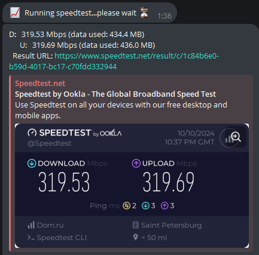

# "Ремонт" работы speedtest в WlanPi Chat Bot

Wlanpi Chat Bot работает под пользователем wlanpi-chat-bot, который не имеет домашней директории и соответственно не может запоминать ничего.

Вся загвоздка в соглашениях EULA и прочих. Чтобы Speedtest работал, нужно принять их соглашение.

Логинимся в WlanPi под wlanpi пользователем и запускаем speedtest, а дальше на запрос о согласии с лицензией - соглашаемся:
```
speedtest
...
Do you accept the license? [type YES to accept]: YES
License acceptance recorded. Continuing.
...
```
Вам нужно создать домашнюю директорию для пользователя wlanpi-chat-bot и следующие необходимые:
```
sudo mkdir -p /home/wlanpi-chat-bot/.config/ookla
```
Копируем файл speedtest-cli.json в папку к пользователю wlanpi-chat-bot:
```
sudo cp .config/ookla/speedtest-cli.json /home/wlanpi-chat-bot/.config/ookla/
```
Меняем владельца директории /home/wlanpi-chat-bot и наследуемых:
```
sudo chown -R wlanpi-chat-bot /home/wlanpi-chat-bot/
```
Перезапускаем сервис whanpi-chat-bot:
```
sudo systemctl restart wlanpi-chat-bot.service
```
До этого в /var/log/syslog были ошибки на запуск speedtest из Telegram, тепепь не будет и Speedtest будте работать отлично.

Дополнительная фича, добавление результата в виде URL на регультат теста.

Открываем:
```
sudo nano /opt/wlanpi-chat-bot/lib/python3.9/site-packages/chatbot/py_commands/speedtest.py
```
Находим:
```
speedtest_cmd = "speedtest | egrep -w \"Testing from|Download|Upload\"
```
И меняем на:
```
speedtest_cmd = "speedtest | egrep -w \"Testing from|Download|Upload|Result\"
```
Всё.

