# Сборка WLAN PI.

[!WARNING]
Запрещается одновременная подача питания через порт USB-C и Ethernet PoE порт!!!

Готовим плату расширения MCUZone

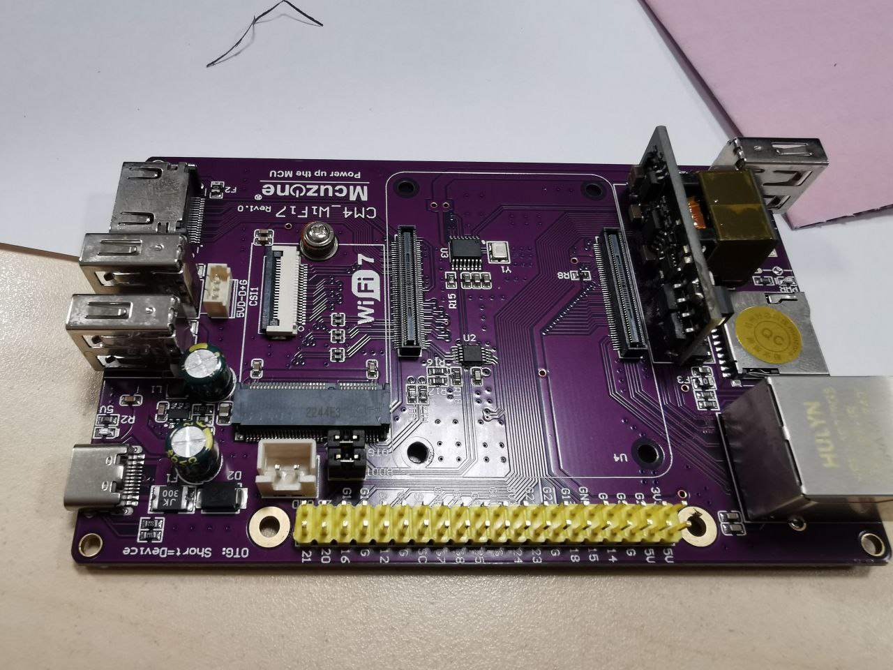

В комплекте с радиатором к MCU Zone идёт радиатор. У радиатора в комплекте:
- винты;
- прокладки под шляпки винтов;
- пластиковые подкладки под CM4;
- шестигранные винты с резьбой внутри и снаружи.

Надеваем прокладки на винты и вставляем их с задней стороны платы MCU Zone. Дальше с лицевой стороны надеваем пластиковые проставки. Вставляем Raspberry Pi CM4 на плату MCU Zone. Ставим термопрокладку на процессор:

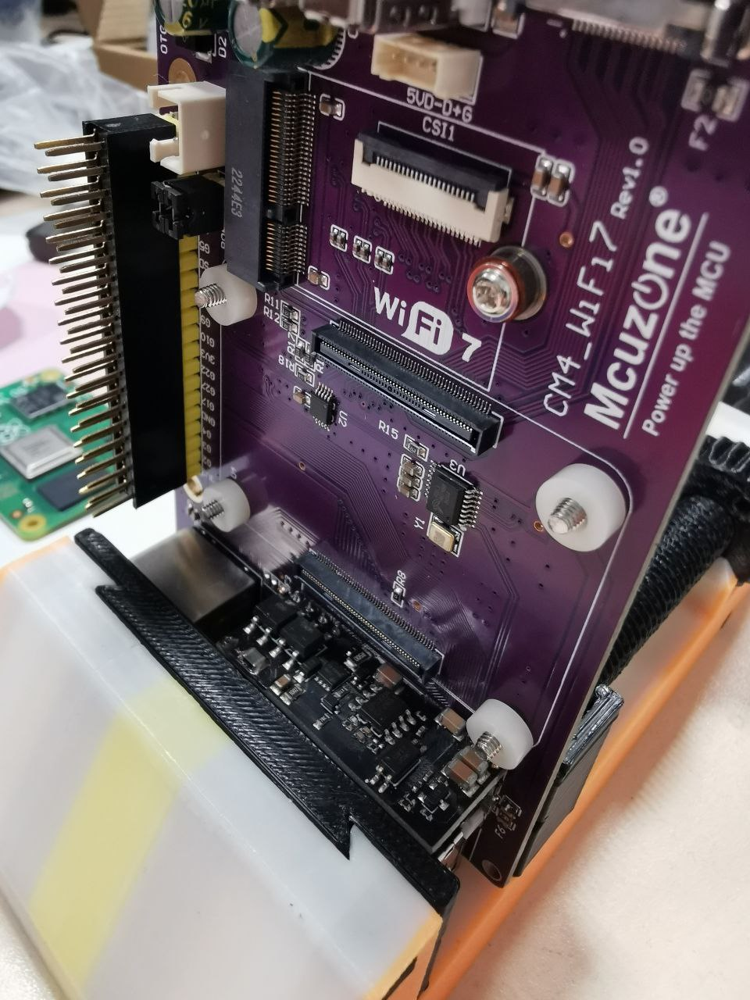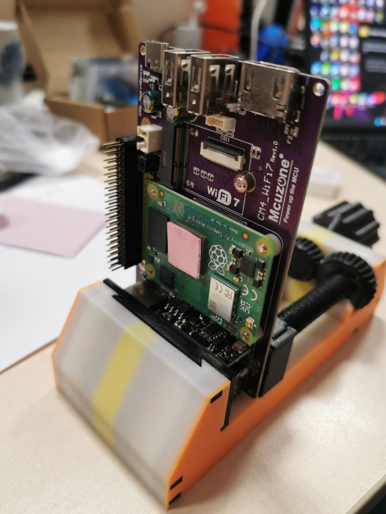

Дальше подготавливаем радиатор. В случае установки экрана необходимо использовать низкопрофильный радиатор:

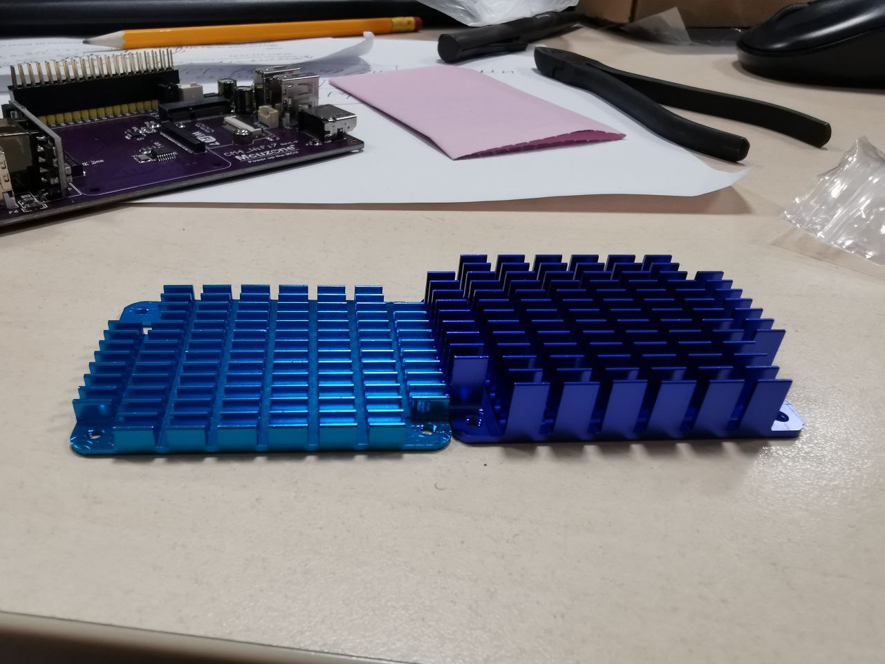

Прикручиваем шестигранные винты с внешней и внутренней резьбой к радиатору, как показано на картинке. Дальше подставляем радиатор к Raspberry Pi CM4, чтобы винты попали в отверстия шестигранных винтов и притягиваем радиатор винтами с обратной стороны платы MCU Zone:

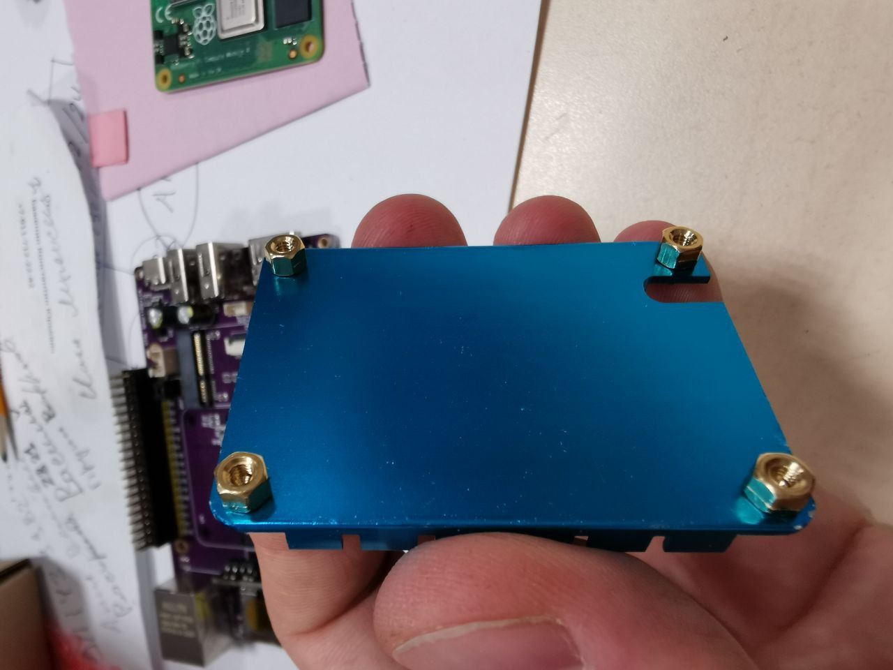

Подключаем модуль Wi-Fi

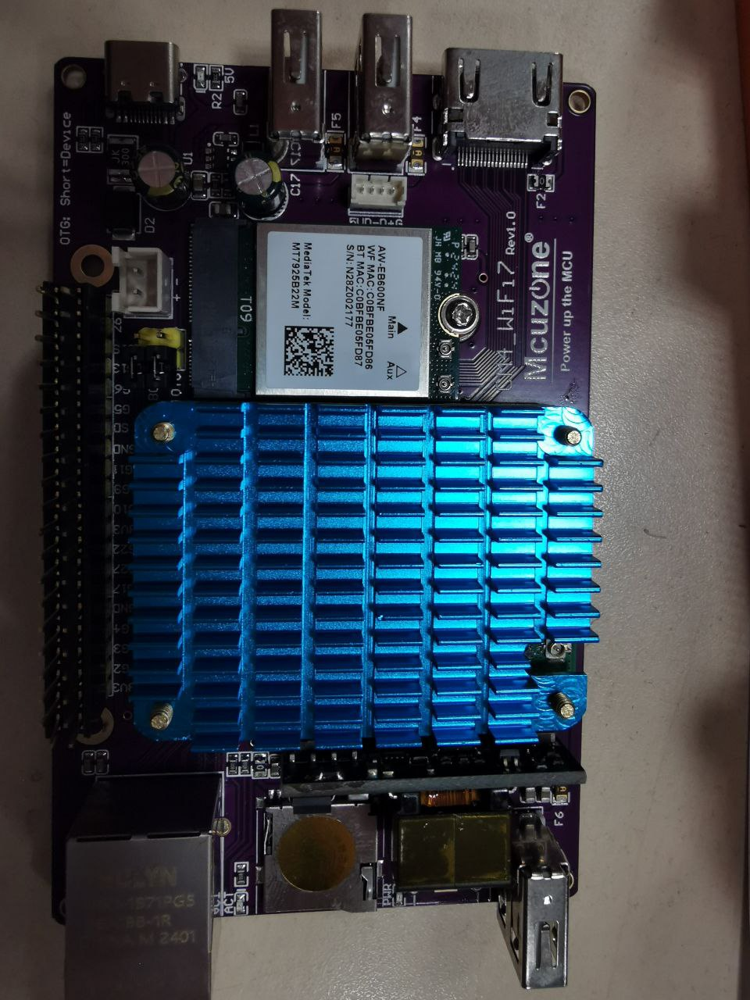

Коммутируем антенны модуля Wi-Fi (mhf4):

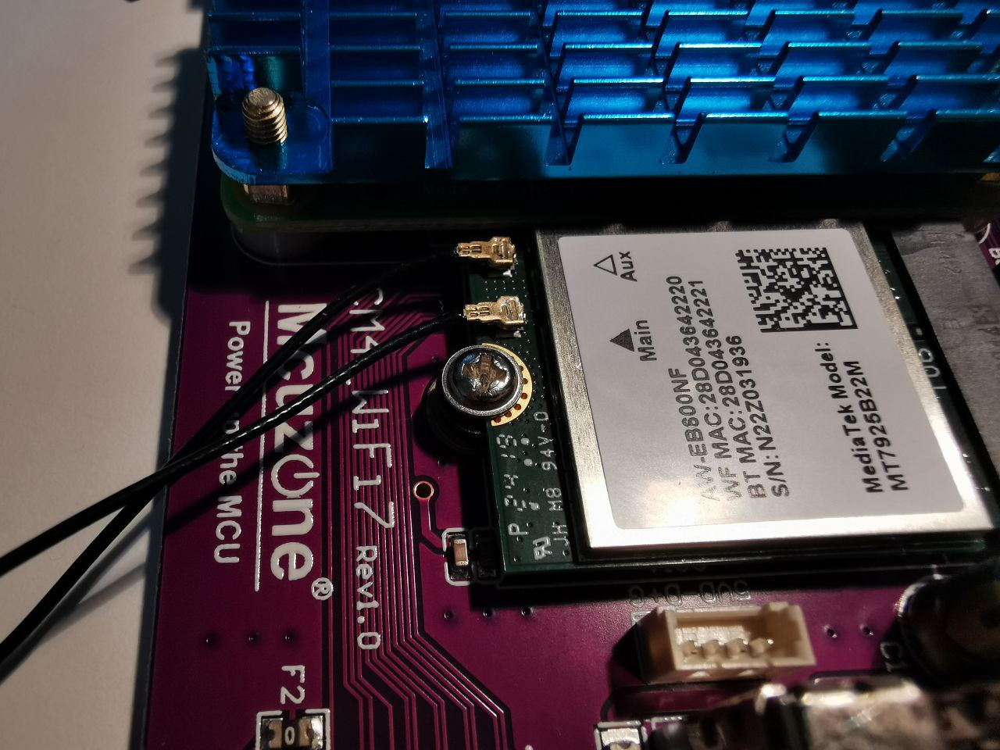

Устанавливаем GPIO удлинитель с высотой пинов 3 мм. Приобретается тот, что на картинке слева:

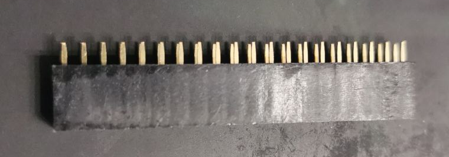
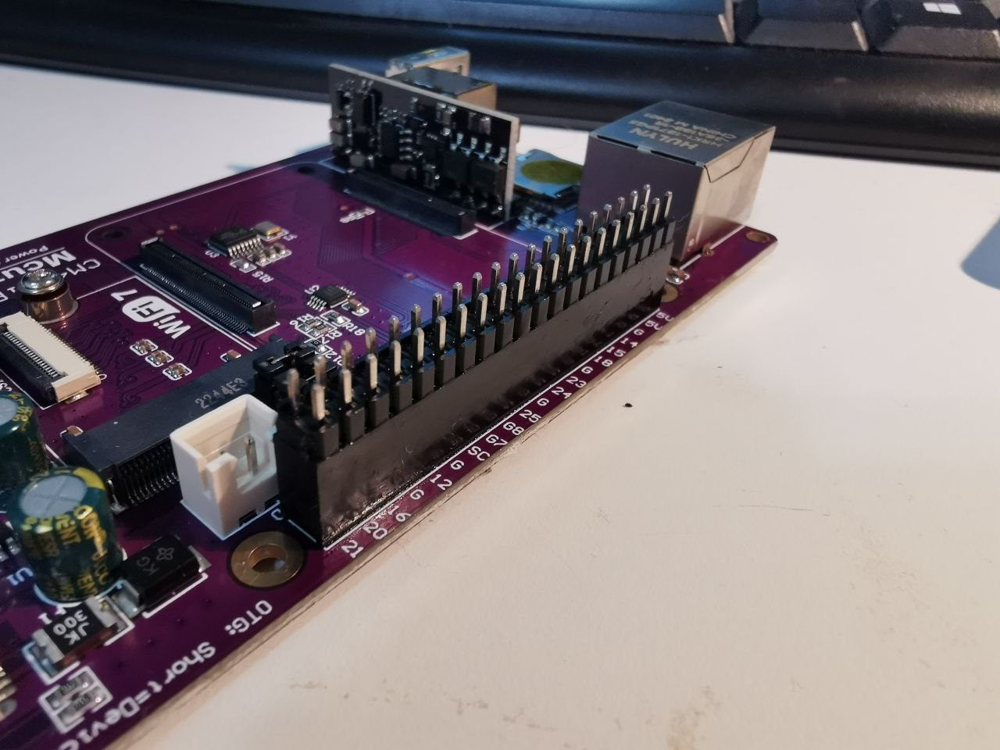

Отключаем джамперы BOOT и OTG (на фото они ещё не сняты):

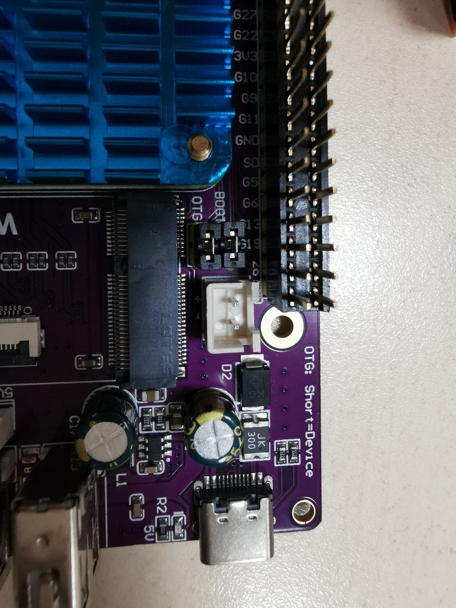

Устанавливаем экран:

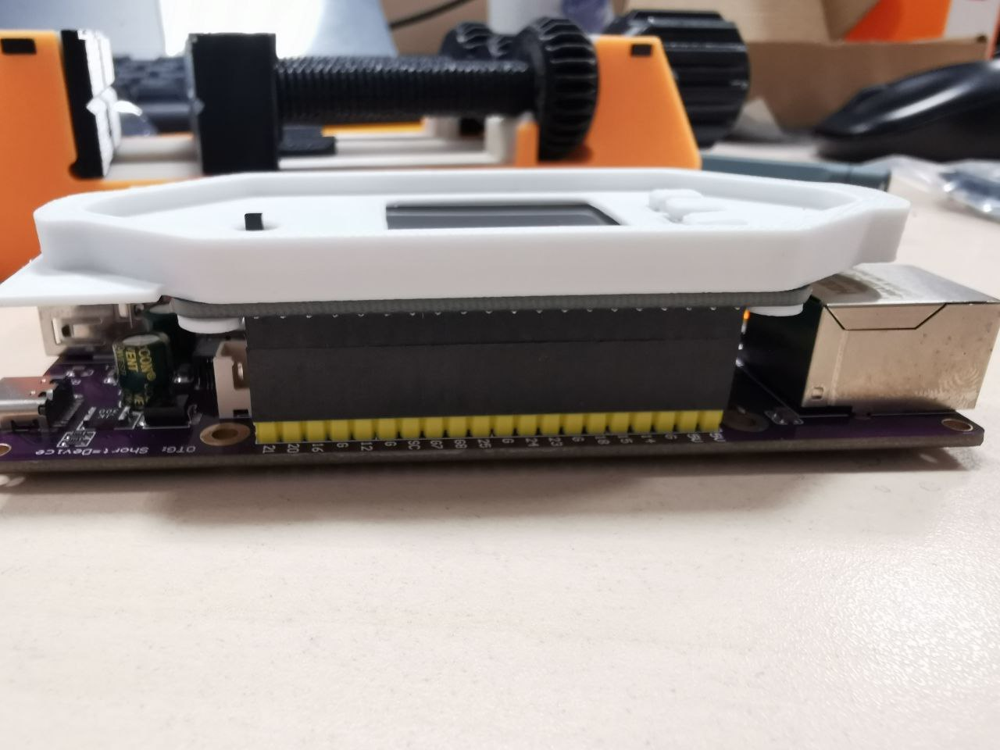

Места размещения антенн представлены ниже:

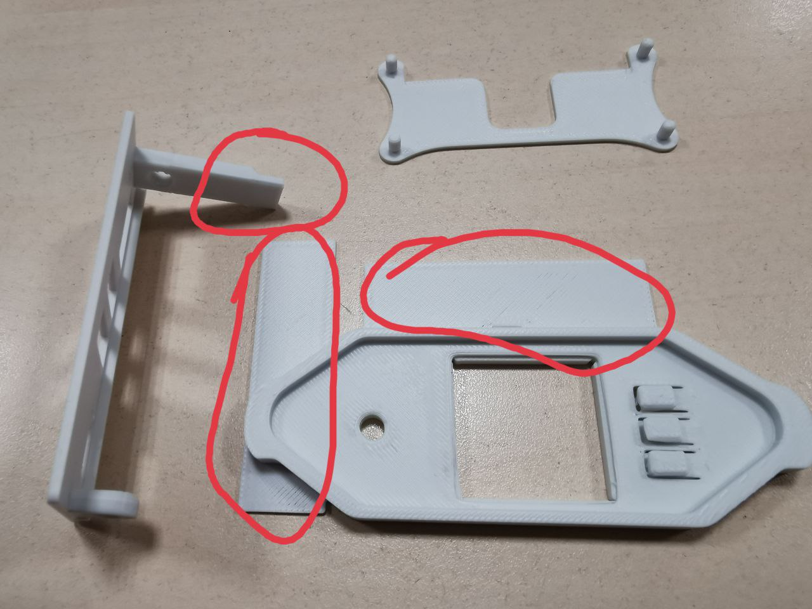

Заливам образ WLAN Pi на SD карту. Взять можно в репозитарии https://github.com/WLAN-Pi/pi-gen/releases/tag/v3.4.2. Стабильным всё-таки пока (12 декабря 2025 г.) является релиз 3.2.2. Ставим SD карту в плату. Запускаем:

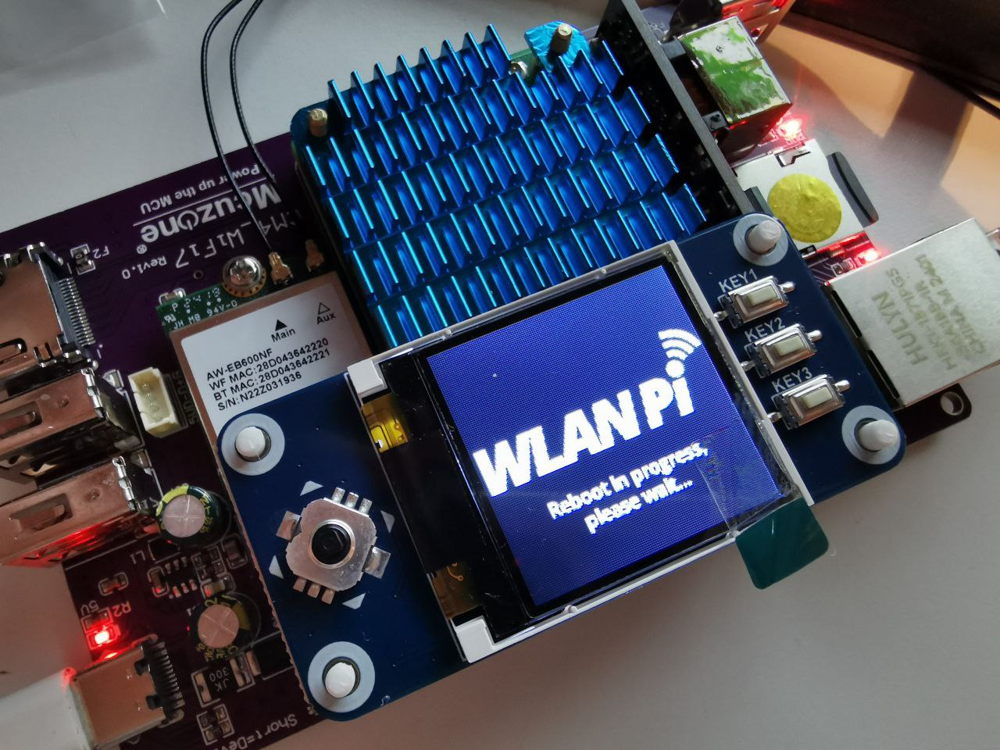

Не забывайте, что нужно зайти по SSH:
- сменить пароль (по умолчанию логин/пароль - wlanpi/wlanpi);
- задать регуляторный домен `sudo wlanpi-reg-domain set RU` (по-моему так);
- установить TimeZone `sudo wlanpi-timezone set Europe/Moscow` (или необходимую вам). 

Спасибо @c60acf23 за сбор моих фото в инструкцию!